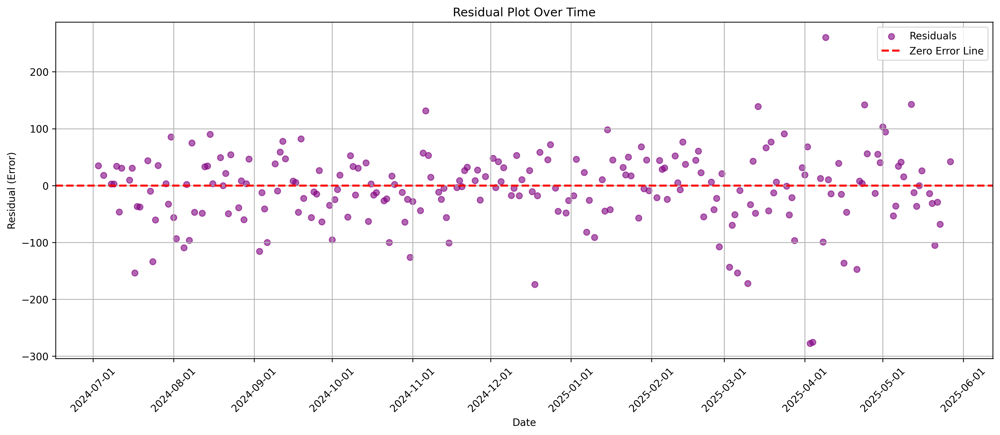
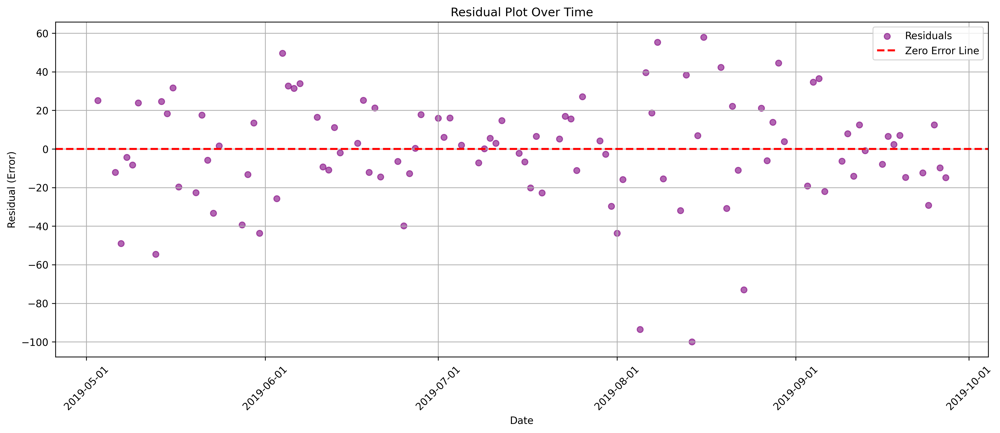
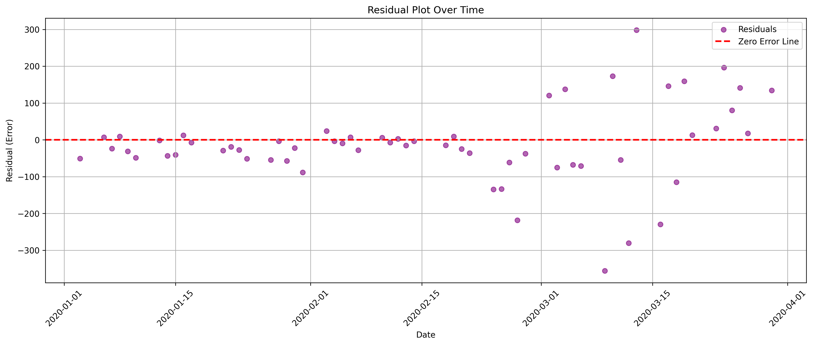

##  Research Motivation & Overview

The economic consequences of political uncertainty have long been a focal point in political economy and financial economics. While classical models like the Efficient Market Hypothesis (EMH) suggest that prices fully reflect public information, newer theories highlight heterogeneity in investor behavior, attention allocation, and narrative amplification.

This project investigates whether media discourse and market behavior demonstrate synchronized sentiment cycles during episodes of heightened uncertainty, particularly in relation to tariff policy shocks.

We hypothesize that emotionally charged, policy-specific media narratives—such as coverage of tariff escalations—not only reflect macroeconomic expectations but actively shape them. Specifically, we ask:  
**Do tariff-related sentiment signals trigger more directional market responses than general financial sentiment?**

To address this, we design a comparative framework that isolates the causal influence of topic-specific sentiment by curating two parallel datasets:

- **Treatment group**: Wall Street Journal articles filtered for “tariff”, “trade war”, “import/export”, and related terms.
- **Control group**: General financial news articles from Bloomberg over the same time frame.

By controlling for time window and model architecture, and varying only the thematic scope of media input, we assess whether markets are more reactive to targeted uncertainty narratives than to ambient sentiment.

##  Scalable Architecture & Methodology

Due to the scale and complexity of the problem, this project employs a multi-stage pipeline that integrates scalable cloud computing infrastructure with deep learning methods for text and time series modeling.

### Why scalable methods are necessary:

- The volume of financial news is extremely large. Scraping platforms like Bloomberg and the Wall Street Journal involves navigating bot-detection systems and dynamic JavaScript-rendered content, which cannot be handled efficiently with simple scripts. We adopt a modular, stepwise crawler design using Playwright and Selenium on AWS EC2 to mimic human browsing behavior.
  
- Sentiment analysis is computationally intensive, especially when applied to thousands of daily records. To ensure performance and scalability, we deploy FinBERT— a transformer-based financial sentiment classifier—via Amazon SageMaker’s **Batch Transform** service, enabling parallel sentiment inference on large batches of text streamed from Amazon S3.

- To extend the scope of our study beyond current events and improve robustness, we integrate the **FNSPID dataset**, which contains over **15.7 million financial news articles** and **29.7 million stock price records** from 2019–2020. This allows us to perform historical backtesting on prior tariff shocks.

- Finally, forecasting is done using a deep learning model—**LSTM (Long Short-Term Memory)**—implemented in PyTorch and trained on uChicago’s Midway High-Performance Computing cluster. This architecture enables efficient modeling of sequential dependencies in financial time series data with high-dimensional inputs including sentiment and technical indicators.

### Summary of Scalable Computing Components:

| Task                  | Bloomberg + Midway (Baihui Wang)                                 | Wall Street Journal + AWS (Charlotte Li)                            |
|-----------------------|--------------------------------------------------------------------|-------------------------------------------------------------------------|
| Web scraping          | Playwright on EC2 (simulates human mouse behavior to bypass bot detection) | Selenium + Requests on EC2 (multi-stage crawler targeting WSJ tariff articles) |
| Sentiment analysis    | FinBERT on Midway (Hugging Face Transformers, local inference)     | FinBERT deployed on SageMaker (Batch Transform using S3 CSV inputs) + matched S&P500 stock data (open, high, low, close, volume) |
| Historical data       | FNSPID dataset: 15.7M news + 29.7M prices (2019–2020 full market span) | Tariff-topic WSJ articles: ~2000 in 2019 and ~1000 in 2020              |
| Sequential modeling   | PyTorch LSTM trained on SageMaker and locally                     | PyTorch LSTM trained on SageMaker and locally                          |
| Backtesting           | Bloomberg-based sentiment models tested on 2019–2020 tariff windows | WSJ-based models backtested on tariff shocks in 2019 and 2020           |

## Results & Interpretation

| Time Window | Context & Evaluation | Interpretation |
|-------------|----------------------|----------------|
| **Train: 2024/07 – 2025/05 (Tariff-specific)** | - R²: 0.9285, RMSE: 65.08, MAE: 46.94 - Apr 2, 2025: Multilateral tariff talks triggered model underreaction | Model fits well under normal volatility but struggles with abrupt political shocks. Residuals spike in April. |
| **Backtest: 2019/05 – 2019/09 (Tariff-specific)** | - R²: 0.8334, RMSE: 27.65, MAE: 20.76 - May 10: U.S. hikes tariffs on $200B; Aug 23: China retaliates | Model aligns well with tariff-driven price movement. High directional precision during policy-centric periods. |
| **Backtest: 2020/01 – 2020/03 (Tariff-specific)** | - R²: 0.9024, RMSE: 107.60, MAE: 71.67 - Jan 15: Phase One signed; Feb–Mar: COVID-19 outbreak | Fit remains decent, but large residuals emerge as pandemic-driven volatility eclipses trade narratives. |
| **Test Set: 2019–2020 (General sentiment, Bloomberg)** | - R²: 0.9641, RMSE: 1.40, MAE: 1.15, MAPE: 2.15% - Based on general financial sentiment from FNSPID | Shows strong numerical precision. Topic diversity enhances stability but reduces responsiveness to discrete tariff shocks. |

**Conclusions**: Tariff-specific models excel in directional forecasting during well-identified policy events, while general sentiment models provide smoother, more stable predictions, especially across mixed regimes or non-policy-driven periods.

###  Summary Interpretation

- **Best predictive performance** (in both direction and magnitude) was observed when:
  - Market shocks were directly linked to **tariff announcements**.
  - Sentiment coverage was **focused, policy-driven**, and temporally aligned with asset price movement.

- **Model robustness declines** when:
  - Narrative regimes **shift suddenly** (e.g., surprise policy reversals in April 2025).
  - External shocks like **COVID-19** dominate market behavior, diluting the predictive power of tariff sentiment.

- **Implications**:
  - Event-specific sentiment features are highly predictive when the **event type is consistent and expected**.
  - However, **single-theme sentiment models** (e.g., tariff-only) may underperform in **multi-causal or high-volatility environments** where cross-domain narratives interact.
 
###  Interpretation of Residual Patterns

Across all three windows, the residual plots reflect how model performance is tightly coupled with the nature and clarity of the dominant market narratives.

- **In the 2024–2025 training window**, residuals were generally centered, but a distinct deviation emerges in early April 2025—coinciding with the announcement of multilateral tariff negotiations. This structural break triggered sharp market volatility, which the model—trained on smoother historical transitions—failed to anticipate. It highlights the limitations of LSTM in responding to abrupt, exogenous policy shocks.

- **In the 2019 backtesting window**, residuals remain small and symmetrically distributed around the zero line. This suggests strong predictive alignment during a period dominated by tariff-related discourse (e.g., May and August 2019 trade actions). The model captures sentiment-driven dynamics well when policy signals are direct and time-aligned.

- **In the 2020 backtesting window**, residuals spike sharply starting mid-February, coinciding with escalating COVID-19 fears. Despite strong fit metrics (R²), the model consistently underestimates market drops during this crisis. This illustrates the limits of single-theme sentiment models in multi-causal regimes, where unexpected health or macro shocks override the influence of trade narratives.

In short, while the LSTM model performs well under stable, tariff-focused conditions, it struggles to generalize during regime transitions or when sudden foreign policy escalations override the sentiment signal.

---

## Overall Conclusion

This study provides empirical support for the idea that media narratives—especially those tied to identifiable policy shocks like tariffs—serve not only as reflections of market fundamentals, but as active drivers of investor sentiment and short-term asset price movement.

We find that:
- Tariff-specific sentiment signals are more directionally predictive during high-policy-salience periods.
- General sentiment models, while numerically stable, are less sensitive to discrete shocks.
- LSTM-based forecasting pipelines offer promising results in structured uncertainty but require enhancements for structural break detection or multi-theme adaptation.

Importantly, our findings also highlight the **economic harm induced by policy uncertainty**. Sudden trade negotiations, ambiguous announcements, or shifting international positions can introduce volatility unrelated to fundamentals—exacerbating investor anxiety, destabilizing markets, and weakening the signal-to-noise ratio in financial decision-making.

These results suggest that **topic-specific sentiment tracking may offer a viable supplement to traditional macro forecasting models**, particularly when integrated into policy-monitoring dashboards or trading signal systems.

---

## Scalability & Future Applications

Our architecture demonstrates how scalable computing tools can be used to bridge textual sentiment and quantitative modeling in real time.

- From crawling 10,000+ dynamic web pages to processing millions of records from FNSPID, the pipeline scales across modalities (web, API, historical archives) and timeframes (daily resolution, multi-year span).
- AWS EC2, SageMaker, and Midway HPC provide the elastic capacity to execute deep learning models and NLP pipelines at scale.
- The design is modular, extensible, and cloud-portable—enabling future integration with real-time news feeds, multi-topic sentiment tracking, or cross-market comparison.

